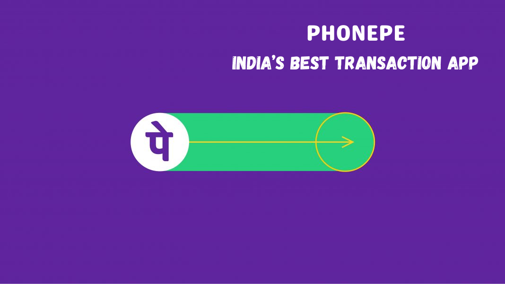

# PhonePe Transaction Insights

A dynamic **Streamlit dashboard** that visualizes and analyzes transaction trends across India using the **PhonePe Pulse dataset**.

##  Features

-  Interactive map-based visualizations (India state/district/pincode levels)  
-  Insights segmented by quarter and year  
-  Identify top-performing states, districts, and pincodes  
-  Interactive filters for in-depth exploration

##  Tech Stack

- **Python** • **Streamlit** • **Plotly** • **PostgreSQL** • **GeoJSON**

##  Demo



##  Installation & Setup

1. **Clone the repository**  
   ```bash
   git clone https://github.com/VijayaBaskar09/PhonePe-Transaction-Insights.git
   cd PhonePe-Transaction-Insights
